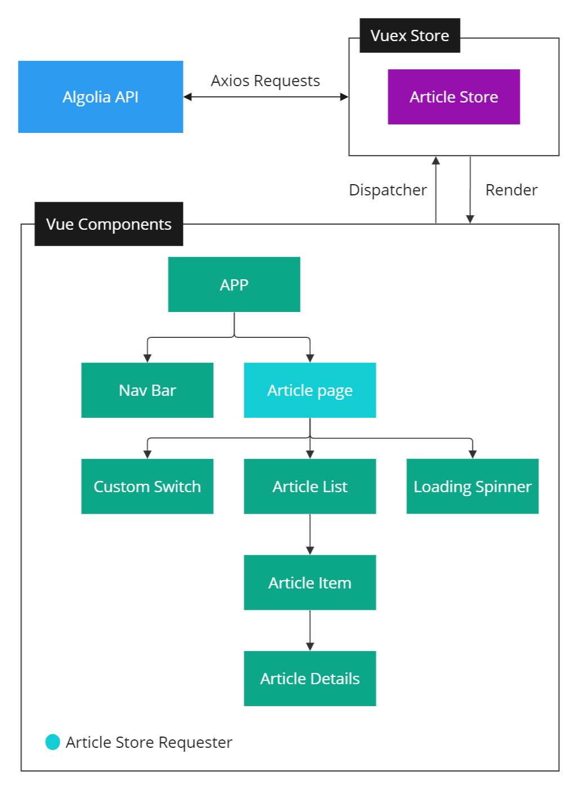

# Vue Homework

## Contents

1. [Summary](#1-summary)
2. [Getting Started](#2-getting-started)
3. [Features](#3-features)
4. [Project Architecture](#4-project-architecture)
5. [Security Aspects](#5-security-aspects)
6. [Error Handling](#6-exception-handling)
7. [References](#7-references)

## 1. Summary

This project provides a web interface to explore coding-related articles sourced from Hacker News. It leverages the Algolia API to fetch articles and is built using Vue.js with Vuetify components.
## 2. Getting Started

To get the project up and running on your local machine, follow these steps:

```bash
# Install dependencies
npm install

# Serve with hot reload at localhost:8080
npm run serve
```

## 3. Features

- **Article Listing**: Displays a list of articles, showing the most recent ones first.
- **Toggle Filter**: Allows users to include or exclude articles without a story URL.
- **Modal Detail View**: Users can view the full details of an article in a modal by clicking a button.
- **Tag Chips**: Article tags are presented as Vuetify chips for easy viewing.


Below are previews of the main view of the Article Explorer in both desktop and mobile formats:
#### Desktop View:


#### Mobile View:


## 4. Project Architecture

The project is structured around Vue components, with state management handled by a Vuex store. Axios is used for API requests to the Algolia API, and components are designed to be reusable and modular. 

 One of the central components of the application is the `ArticlePage`, which plays a crucial role in the user experience by:

- **Fetching Articles**: Leveraging Vuex actions, `ArticlePage` initiates the fetching of articles from the Algolia API upon creation. It utilizes Axios for these HTTP requests, ensuring efficient and reliable data retrieval.

- **Dynamic UI Responses**: The component reacts to the `fetchStatus` state to dynamically adjust the UI, displaying a custom spinner during data loading (`loading`), a message on failure (`error`), and the article list upon successful fetch (`success`).

- **User Interactivity**: Provides a toggle switch allowing users to filter articles based on their preferences, such as showing or hiding articles without a direct link. This interactivity enhances the user's engagement with the content.

Below is the project architecture diagram:



## 5. Security Aspects

This project adheres to security best practices within a Vue.js application context, ensuring the integrity and security of API interactions.

- **Environment Variables**: API endpoints are defined through environment variables, which enhances security by keeping sensitive configuration out of the codebase.

- **Request Timeout**: Requests have a set timeout to prevent the application from waiting indefinitely for a response, thus ensuring better control over system resources and responsiveness.

- **Content-Type Enforcement**: The `Content-Type` header is set to `application/json`, which means the server expects to receive only JSON content. This helps in safeguarding against incorrect data handling and potential content-type related threats.

- **Vuex Store**: The Vuex store is utilized for state management, ensuring that state data is centralized, predictable, and debuggable. The Vuex patterns help in avoiding direct manipulation of state from outside components, which can prevent unexpected changes and maintain data integrity.

## 6. Exception Handling


The application is designed to handle exceptions and errors gracefully, enhancing user experience even when unexpected situations arise.

- **State Management**: The `fetchStatus` state within the `ArticlePage` component controls the rendering of the UI according to the status of the API call (`loading`, `success`, `error`). This state-driven approach ensures that users are always presented with the correct interface elements for the given situation.

- **User Feedback**: During data fetching, a custom spinner is displayed to indicate that articles are being loaded. If an error occurs (e.g., network issue, server error), the UI will present a user-friendly message informing them that the articles failed to load and advising them to try again later.

- **Render Avoidance**: To prevent an inconsistent UI, rendering of the main article list is conditional upon a successful API response. This ensures that the application does not attempt to render article data that may not have been successfully fetched.

Future enhancements may include implementing a detailed error logging mechanism that captures specific error information while presenting an appropriate level of detail to the end-user, balancing transparency and user experience.


## 7. References

- Vuex: <https://vuex.vuejs.org/>
- Vuetify: <https://vuetifyjs.com/en/components>
- State Management: <https://vuex.vuejs.org/#what-is-a-state-management-pattern>
- Axios: <https://axios-http.com/docs/api_intro>